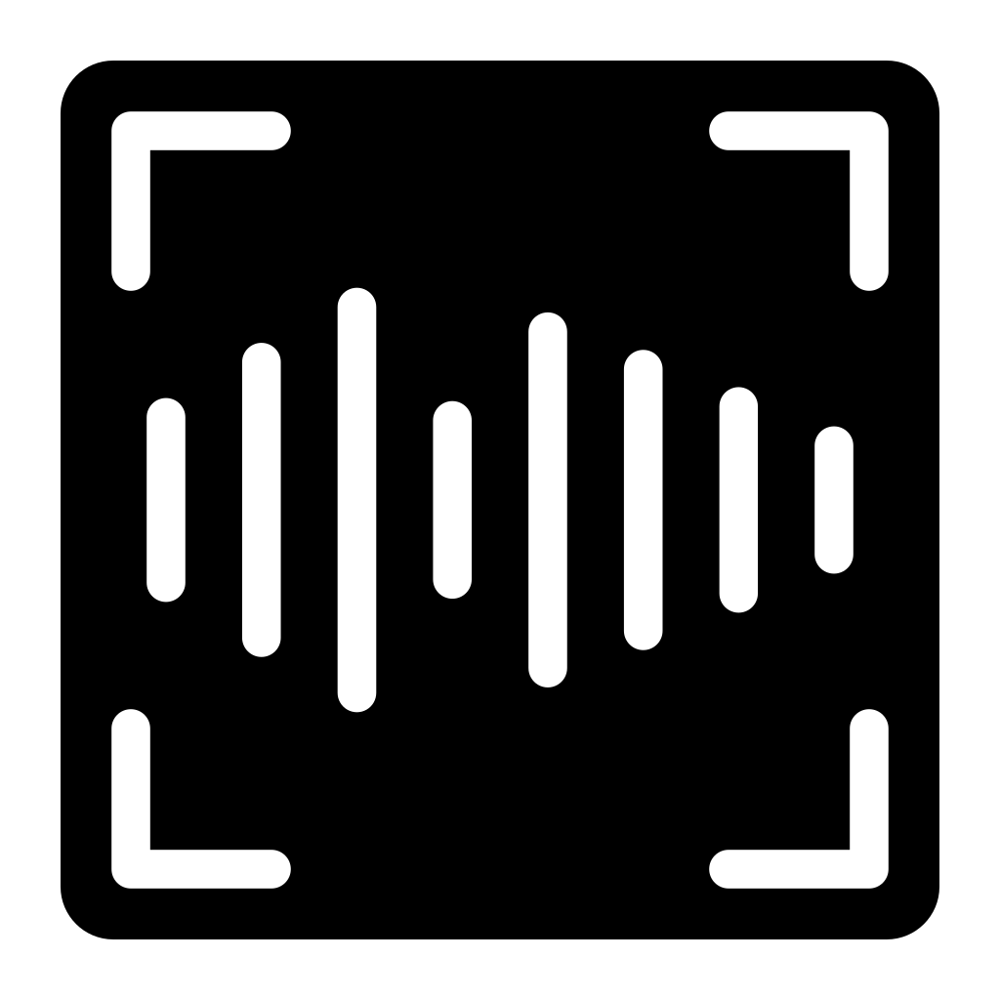

# IoTSmartWatch-App

A comprehensive iOS app for controlling a smartwatch, featuring real-time weather updates, voice control, and more
# SmartWatch IoT Control System

The SmartWatch IoT Control System is a complete solution that combines an iOS app and an ESP8266-based smartwatch, offering advanced features such as voice control, real-time weather updates, automatic brightness control, and more.

## Table of Contents

- [Features](#features)
- [iOS App](#ios-app)
- [Microcontroller](#microcontroller)
- [Server Communication](#server-communication)
- [Contributions](#contributions)
- [License](#license)
- [Acknowledgments](#acknowledgments)
- [Contact](#contact)
- [Project Status](#project-status)
- [Credits](#credits)

## Features

- **Voice Control**: Use the iOS app to control the smartwatch with voice commands, providing a hands-free and convenient experience.

- **Real-Time Weather Updates**: Stay updated with current weather conditions on the smartwatch display.

- **Automatic Brightness Control**: The smartwatch's display adjusts to ambient light conditions for optimal visibility.

- **Internet Time Synchronization**: Accurate timekeeping is ensured with synchronization to internet time servers.

### iOS App

The iOS app, developed in Swift, serves as the central control hub for the smartwatch. It includes voice recognition, user interface, and communication features.

### Microcontroller

The MicroPython code running on the ESP8266 microcontroller controls the smartwatch's hardware. It manages the OLED display, network connections, and responds to HTTP requests from the iOS app.

### Prerequisites

- To use the iOS app, ensure you have Xcode and an iOS development environment set up.

- For the smartwatch, ensure that the ESP8266 hardware components are properly assembled and have the required firmware installed.

### Installation

- Install the iOS app on your iOS device or use it from the Simulator on XCode.

- Connect the iOS app to your smartwatch for voice-controlled interactions.

For detailed usage instructions, refer to the [Usage](#usage) section in this README.

## Server Communication

The smartwatch's MicroPython code handles communication with a server for processing recognized text from voice commands. Ensure the server's URL is specified in the code.

## Contributions

We welcome contributions to enhance and extend the functionality of this project. Feel free to submit pull requests, report issues, or get in touch with your ideas.

## License

This project is licensed under the MIT License. For more details, please see the [LICENSE.md](LICENSE.md) file.

## Acknowledgments

We extend our gratitude to the open-source community and contributors for their invaluable support.

## Contact

If you have questions, suggestions, or would like to collaborate, please don't hesitate to contact us at tj2557@columbia.edu.

## Project Status

This project is actively developed and maintained.

# Credits
This app was developed by Tharun Kumar Jayaprakash.

